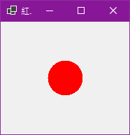
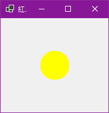
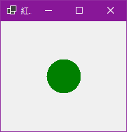

# 簡答題
## 15-4
### 在FileInfo物件建立新文字檔是使用<ins> CreateText() </ins>方法，新增文字內容至檔尾是呼叫<ins> AppendText() </ins>方法來開啟檔案。
## 15-5
### 檔案對話方塊依用途分為2種控制項：<ins> OpenFileDialog控制項 </ins>和<ins> SaveFileDialog控制項 </ins>。

 
# 實做題
## 1_10-3
### 請依照[第10-3-1節的類別圖](./images/10-3-1.png)寫出C#程式的IPrice介面和Car類別，以便顯示車輛價格。

## 2_11-1
### 請建立2個過載的類別方法Cube()，可以分別計算int和double參數的平方，然後建立2個過載MinElement()類別方法，傳入3個或4個int參數，其傳回值是參數中的最小值。

## 3_12-3
### 請建立單位轉換的C#程式，一英尺有12英吋；一英碼等於3英尺，FeetToInches()方法可以將英尺轉換成英吋；YardsToInches()方法將英碼轉換成英吋，程式在輸入英吋後，使用委派來動態執行轉換方法。

## 4_13-3
### 請建立C#應用程式，在表單使用標籤控制項模擬紅燈，預設背景是紅色代表紅燈，按滑鼠左鍵改為黃色的黃燈；右鍵改為綠色的綠燈。

